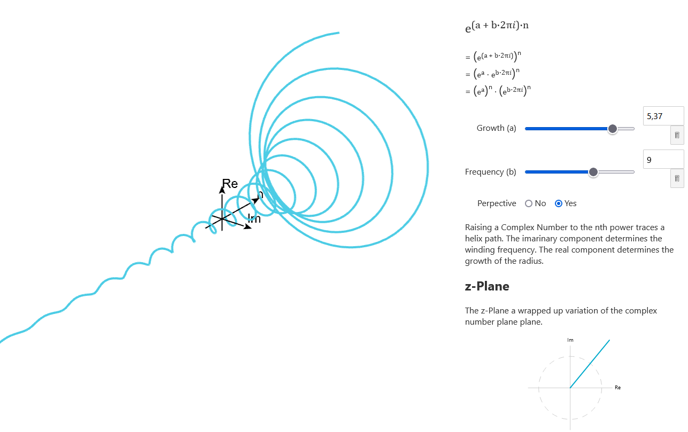

[Live Demo](https://static.laszlokorte.de/complex-exponential/)

# Complex exponential

Raising a Complex Number to the nth power traces a helix path. The imarinary component determines the winding frequency. The real component determines the growth of the radius.